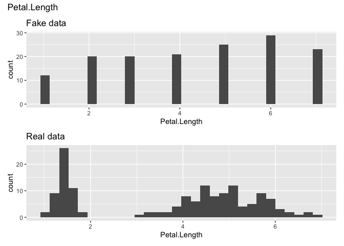
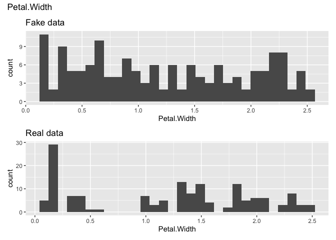

<!-- README.md is generated from README.Rmd. Please edit that file -->

# faker

<!-- badges: start -->

[](https://lifecycle.r-lib.org/articles/stages.html#experimental)
[](https://github.com/asiripanich/faker/actions)

<!-- badges: end -->

The goal of faker is to help with generating a fake dataset from a real
dataset for testing purposes.

## Installation

You can install the development version of faker like so:

``` r
remotes::install_github("asiripanich/faker") 
```

## Example

Let’s example with the iris dataset

``` r
library(faker)

dataset <- iris %>%
  # make Petal.Length an intergish vector.
  dplyr::mutate(Petal.Length = round(Petal.Length))

head(dataset, 10)
#>    Sepal.Length Sepal.Width Petal.Length Petal.Width Species
#> 1           5.1         3.5            1         0.2  setosa
#> 2           4.9         3.0            1         0.2  setosa
#> 3           4.7         3.2            1         0.2  setosa
#> 4           4.6         3.1            2         0.2  setosa
#> 5           5.0         3.6            1         0.2  setosa
#> 6           5.4         3.9            2         0.4  setosa
#> 7           4.6         3.4            1         0.3  setosa
#> 8           5.0         3.4            2         0.2  setosa
#> 9           4.4         2.9            1         0.2  setosa
#> 10          4.9         3.1            2         0.1  setosa

fake_dataset <- fake_this(dataset) |>
  fake_preserve(Sepal.Length, Species) |>
  fake_generate()
#> Var: Sepal.Length
#> Var: Sepal.Width
#> Var: Petal.Length
#> Var: Petal.Width
#> Var: Species
```

<!-- Faking a travel survey: -->
<!-- ```{r warning=FALSE} -->
<!-- library(vista) -->
<!-- vista_data <- get_vista18() -->
<!-- fake_persons <- fake_this(vista_data$trips) |> -->
<!--   fake_preserve( -->
<!--     tripid, persid, hhid, tripno, stops -->
<!--   ) |> -->
<!--   fake_generate() -->
<!-- waldo::compare( -->
<!--   vista_data$persons[seq_len(10), ], -->
<!--   fake_persons$dataset[seq_len(10), ] -->
<!-- ) -->
<!-- ``` -->

``` r
library(ggplot2)
library(patchwork)

fake_vars <- fake_dataset$info %>% 
  dplyr::filter(preserve == FALSE) %>% 
  dplyr::pull(name)

for (var in fake_vars) {
  fake_plot <-  ggplot(fake_dataset$dataset, aes(.data[[var]])) +
    geom_histogram() +
    labs(title = "Fake data")

  real_plot <- ggplot(iris, aes(.data[[var]])) +
    geom_histogram() +
    labs(title = "Real data")

  p <- fake_plot / real_plot +
    patchwork::plot_annotation(title = var)

  print(p)
}
#> `stat_bin()` using `bins = 30`. Pick better value with `binwidth`.
#> `stat_bin()` using `bins = 30`. Pick better value with `binwidth`.
```


    #> `stat_bin()` using `bins = 30`. Pick better value with `binwidth`.
    #> `stat_bin()` using `bins = 30`. Pick better value with `binwidth`.



    #> `stat_bin()` using `bins = 30`. Pick better value with `binwidth`.
    #> `stat_bin()` using `bins = 30`. Pick better value with `binwidth`.


